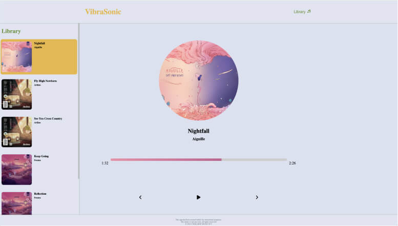

# Vibrasonic

## Table of contents

- [Overview](#overview)
- [Project Links](#links)
- [Development](#development)
- [What I Learned](#what-i-learned)
- [Issues](#issues)
- [To Do](#to-do)
- [Acknowledgments](#acknowledgments)
- [Author](#etienne-desfontaines)

## Overview

A web based music player built as a guided exercise in learning React. This project was part of Dev Ed's "Creative React" Course.

### My Roles:

- Developer

### Links

- [Live site](https://vibra-sonic-music-player.netlify.app/)

## Development

### Technologies Used:

- HTML5
- CSS3
- Sass
- JavaScript
- React

### My process

This was a instructor guided build covering the fundementals of React.

## What I learned

### React

- Thinking in React: UI component hierarchy, identifying where state is needed, unidirectional data flow.

- JSX
- Components
- Conditional Rendering
- Dynamic Component Rendering
- Events
- Props and State
- Virtual DOM
- Hooks: useState, useEffect, useRef
- Rendering lists and unique keys for list items

## Acknowledgments

Dev Ed and his "Creative React Course".

## Etienne Desfontaines

- [Website](https://etiennedesfontaines.com/)
- [Linkedin](https://www.linkedin.com/in/etienne-desfontaines-818349284/)
- [Frontend Mentor](https://www.frontendmentor.io/profile/etiennedesfontaines)
- [Exercism](https://exercism.io/profiles/etiennedesfontaines)
